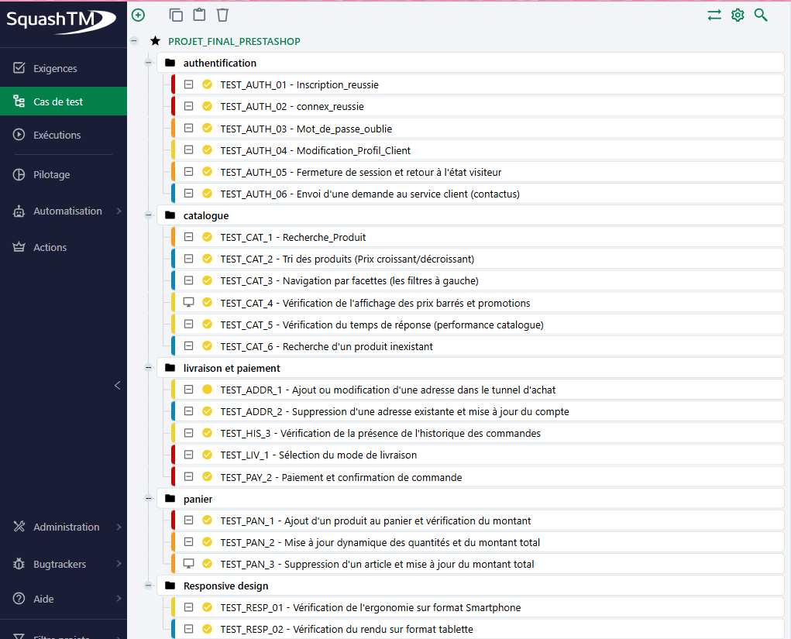
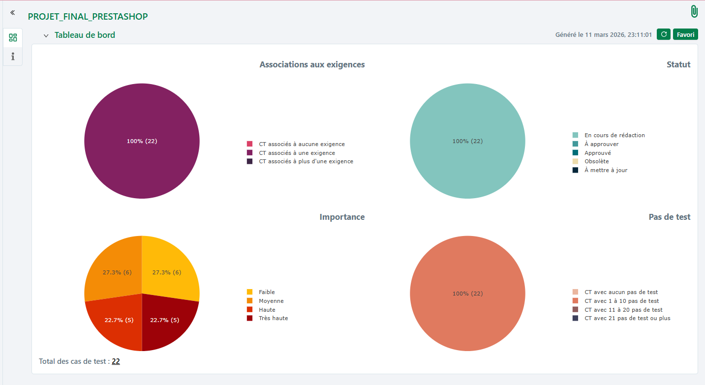

# Projet de Recette : Boutique PrestaShop (e-commerce)

Ce dépôt contient les livrables de la **Phase 1 : Analyse et Conception** pour le projet de test logiciel de la boutique PrestaShop.

## Informations Candidat
* **Nom :** Rimene Ben Elouaer
* **Rôle :** Testeur QA
* **Environnement de test :** Windows / Chrome
  
## Objectif de la Phase 1
L'objectif est de définir la stratégie de test et de garantir une couverture complète des exigences fonctionnelles de la plateforme avant l'exécution.

### Travail réalisé :
* **Identification des Exigences :** Analyse des besoins (Authentification, Catalogue, panier, livraison, responsive).
* **Rédaction des Cas de Test :** Création de 22 scénarios de test détaillés.
* **Matrice de Traçabilité :** Création du lien entre les exigences et les tests pour s'assurer qu'aucun besoin n'est oublié.

## livrables
* [Matrice_Conception_Phase1.xlsx](./Matrice_tracabilite_Prestashop%20.xlsx) : Ce fichier contient l'en-tête de l'environnement, les préconditions, les étapes de test détaillées et les résultats attendus.

##  Visualisation Squash TM

Voici une vue d'ensemble de la structure des cas de test conçus dans l'outil  Squash TM :

### Arborescence du Projet

### Tableau de bord de Conception
*

##  Outils utilisés
* **Squash TM :** Gestion des cas de test
* **Excel :** Matrice de traçabilité bidirectionnelle
* **MantisBT :** Gestion des anomalies (phase 2)
* **GitHub :** versioning du projet
